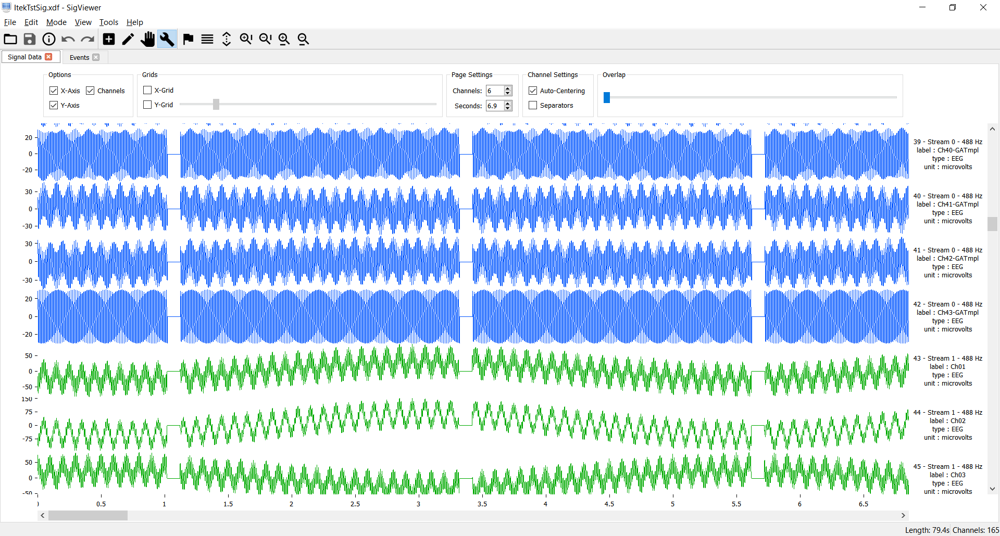

# Libxdf - a C++ library for loading [XDF](https://github.com/sccn/xdf/wiki/Specifications "Extensible Data Format") files


* [Introduction](#intro)
* [Download](#download)
* [Quick-Start Guide](#quick)
* [Documentation](#doc)
* [Support](#support)


## <a name="intro"></a>Introduction

Libxdf is a cross-platform C++ library for loading multimodal, multi-rate signals stored in [XDF](https://github.com/sccn/xdf/wiki/Specifications  "Extensible Data Format") files.
Libxdf is used in the  biosignal viewing application [SigViewer](https://github.com/cbrnr/sigviewer). It can also be integrated into other
C++ applications.

Libxdf is open-source, free, and actively maintained.


## <a name="download"></a>Download

* [Source code (zip)](https://github.com/Yida-Lin/libxdf/archive/0.94.zip)
* [Source code (tar.gz)](https://github.com/Yida-Lin/libxdf/archive/0.94.tar.gz)
* [Pre-built binaries](https://github.com/Yida-Lin/libxdf/releases)

## <a name="quick"></a>Quick-Start Guide

### Building libxdf
Libxdf can be conveniently built either using `qmake` or `cmake`. Configuration files for both build tools are included with the source.

### Use in conjunction with [SigViewer](https://github.com/cbrnr/sigviewer)

Libxdf is a built-in component of [SigViewer](https://github.com/cbrnr/sigviewer). If you wish to build SigViewer from source, follow these steps:

1. Download `xdf.h` and `libxdf.a` from the [release](https://github.com/Yida-Lin/libxdf/releases) page.
2. Copy `xdf.h` into `sigviewer/external/include`
3. Copy `libxdf.a` into `sigviewer/external/lib`
4. Build and run Sigviewer




Example: SigViewer using _libxdf_ to display signals in an XDF file.

### Use in other C++ applications

1. Build libxdf from source or use a pre-built binary release
2. Instantiate an object of the `Xdf` class and call the `load_xdf` method.

Example:

```C++
#include "xdf.h"

Xdf XDFdata;
XDFdata.load_xdf("C:/example.xdf");
```

To resample the signals to e.g. 100Hz:

```C++
XDFdata.resample(100);
```

The functions in libxdf must be called following a certain order. For instance, if you call the `subtractMean` function before you load any data, it will cause undefined behavior.

The recommended order is shown here. Only `load_xdf` is mandatory.

```C++
XDFdata.load_xdf(std::string filepath);
XDFdata.subtractMean();
XDFdata.createLabels();
XDFdata.resample(int sampleRate);
XDFdata.freeUpTimeStamps();
```

Libxdf depends on third party libraries [Pugixml v1.8](http://pugixml.org/) for XML parsing and [Smarc](http://audio-smarc.sourceforge.net/) for resampling.

## <a name="doc"></a> Documentation
Detailed documentation was generated via [Doxygen](http://www.stack.nl/~dimitri/doxygen/index.html) and is available [here](docs/html/class_xdf.html).

## <a name="SigViewer"></a> SigViewer Online Repo
SigViewer Online Repository is [here](repository/Updates.xml).

## <a name="support"></a>Support

[Email author](mailto:yida.lin@outlook.com) or report a new [issue](https://github.com/Yida-Lin/libxdf/issues).
